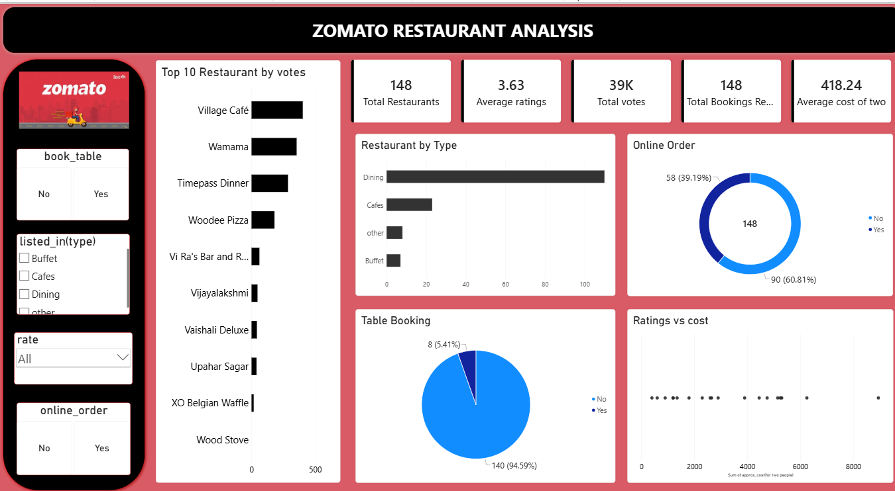

#  Zomato Restaurant Analysis – Power BI

##  Project Overview

This project is a **Zomato Restaurant Analysis Dashboard** created using **Microsoft Power BI**.

The main purpose of this project is to analyze restaurant data and understand restaurant types, customer ratings, votes, online ordering, table booking, and approximate cost for two people.

The dashboard provides an interactive and easy-to-understand view of the restaurant data using KPIs, charts, and filters.

---

##  Objectives

- Analyze the number of restaurants.
- Understand different types of restaurants.
- Analyze restaurant ratings and customer votes.
- Compare restaurants based on votes.
- Analyze online ordering availability.
- Analyze table booking availability.
- Understand the approximate cost for two people.
- Identify highly voted restaurants.
- Compare restaurant ratings with cost.

---

##  Tools Used

- **Microsoft Power BI**
- Power Query
- Data Cleaning
- Data Transformation
- Data Visualization

---

##  Dataset

The dataset contains restaurant-related information with the following columns:

| Column | Description |
|---|---|
| `name` | Name of the restaurant |
| `online_order` | Whether online ordering is available |
| `book_table` | Whether table booking is available |
| `rate` | Restaurant rating |
| `votes` | Number of customer votes |
| `approx_cost(for two people)` | Approximate cost for two people |
| `listed_in(type)` | Type/category of the restaurant |

---

##  Dashboard KPIs

The dashboard includes the following key metrics:

- **Total Restaurants:** 148
- **Average Rating:** 3.63
- **Total Votes:** 39K
- **Average Cost for Two:** 418.24

---

##  Dashboard Visualizations

The Power BI dashboard contains:

- Top 10 Restaurants by Votes
- Restaurant by Type
- Online Order Analysis
- Table Booking Analysis
- Ratings vs Cost
- KPI Cards
- Interactive Slicers

###  Filters / Slicers

Users can filter the dashboard using:

- Book Table
- Restaurant Type
- Rating
- Online Order

---

##  Key Insights

- **Dining** is the most common restaurant type in the dataset.
- A large number of restaurants provide **online ordering**.
- **Table booking is available for only a smaller portion of restaurants**.
- The dashboard shows the restaurants receiving the highest number of customer votes.
- Restaurant ratings and approximate cost can be compared to understand pricing and customer perception.
- The dashboard helps identify patterns in restaurant types, ratings, customer votes, and ordering options.

---

##  Dashboard Preview

---

##  Future Scope

The project can be improved further by:

- Adding restaurant location analysis using maps.
- Analyzing restaurants city-wise or area-wise.
- Adding cuisine-level analysis.
- Analyzing rating trends.
- Comparing cost and customer ratings in more detail.
- Adding more advanced Power BI measures and interactive visuals.

---

##  Conclusion

This project demonstrates how **Power BI can be used to transform restaurant data into meaningful business insights**.

The dashboard provides an interactive way to understand restaurant performance, customer engagement, pricing, ratings, online ordering, and table booking.
